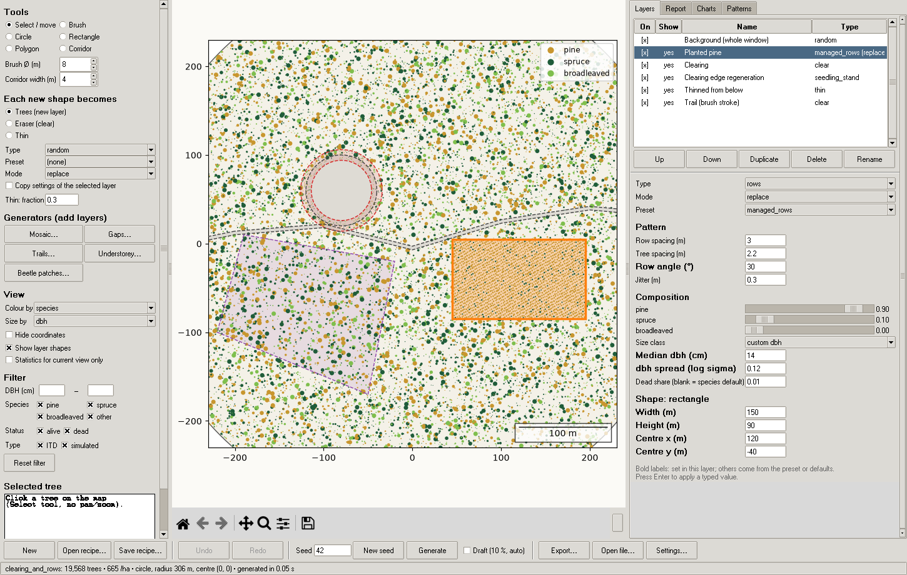

# synthforest

**Paint synthetic forests.** Draw where trees are, how they are arranged
(random, clustered, regular, rows, gradients), what they are like (species,
size, alive or dead) and where there are none (clearings, trails). The tool
generates the trees, shows them, and exports them as treemaps in the same
format as the laser-scanning-derived treemaps of the forest recreation
research project at the Natural Resources Institute Finland. The same
analysis code runs on synthetic and real data, and synthetic data can be
shared freely.

The tool also opens existing CSV and RDS treemaps, synthetic or real, for
viewing and for editing: paint clearings, thinnings, trails or new stands
on top of their trees. Everything runs locally; the program makes no
network connections.



## Install and start

Python 3.10 or newer (tested with 3.10 and 3.14) on Windows, Linux or macOS.

```
pip install -r requirements.txt
python synthforest.py
```

Only six packages are needed: numpy, scipy, shapely (2.x), matplotlib,
pandas and pyreadr. The GUI uses tkinter, which comes with Python from
python.org (on Debian/Ubuntu: `sudo apt install python3-tk`). If a package
is missing, the program says which one and prints the `pip install` line.

## Command line

```
python synthforest.py                                        # GUI (painting editor)
python synthforest.py generate recipe.json --seed 42 --out forest --formats csv,rds,png
python synthforest.py report forest.csv                      # realism report of a CSV or RDS file
python synthforest.py view forest.rds                        # open a file in the viewer
python synthforest.py edit treemap.rds                       # paint layers on a file's trees
python synthforest.py example mosaic_with_trail > my_recipe.json
python synthforest.py example                                # list the examples
python synthforest.py validate recipe.json                   # list every problem in a recipe
```

`generate` options: `--seed N` (default: the recipe's seed), `--out NAME`
(default: the recipe's name), `--formats` (any of `csv,rds,png,svg,pdf`),
`--colour-by species|status|type|layer`, `--hide-coordinates`. It always
writes `NAME-truth.csv`, `NAME-recipe.json` and `NAME-report.txt` too.

## Using the GUI

**Painting editor** (the default window)

* **Tools** (left): *Select / move*, *Brush* (freehand, adjustable
  diameter), *Circle*, *Rectangle*, *Polygon* (click vertices, double-click
  or Enter to close) and *Corridor* (click points, double-click or Enter to
  finish). Esc cancels a shape; Backspace removes the last point.
* **Each new shape becomes** a new layer: *Trees* (with the chosen type,
  preset and mode, or a copy of the selected layer's settings), *Eraser*
  (a `clear` layer) or *Thin* (a `thin` layer). Any shape works with any of
  the three, so you can erase with the brush, a circle or a polygon.
* **Generators** add ordinary, editable layers: *Mosaic* (Voronoi stand
  patches), *Gaps* (clearings with regeneration around the edge), *Trails*,
  *Understorey* and *Beetle patches*.
* **Layers tab** (right): the ordered list (applied top to bottom). Click
  *On* to enable or disable a layer and *Show* to show or hide its shape.
  Up, Down, Duplicate, Delete and Rename are below the list. Selecting a
  layer highlights its shape and opens its parameters: type, mode, preset,
  pattern parameters, species sliders (they always sum to 1), size class
  and dead share. Values in bold are set in the layer; the others come from
  the preset or the defaults. Drag a selected shape on the map to move it.
* **Generate** makes the full forest. With **Draft** on, every edit
  regenerates automatically at 10 % density for instant feedback.
* **Undo / Redo** cover every edit. The recipe is autosaved after every
  change to a recovery file (`~/.synthforest/recovery.json`, on Windows
  `%APPDATA%\synthforest\recovery.json`). After a crash it is offered back
  on the next start. Errors appear as dialogs, the program keeps running,
  and details go to `errors.log` in the same folder.
* **Export** writes CSV, RDS, the truth file, the recipe copy, the report
  and a map image (PNG, SVG or PDF). **Settings** sets the window shape and
  size, the laser artefacts and the background forest.

**Viewer** (*Open file…* or `python synthforest.py view FILE`)

* It opens CSV or RDS files in the output format, synthetic or real. If a
  `NAME-recipe.json` sits next to the file, its window is used; otherwise a
  window is fitted to the trees (see [Editing tree files](#editing-tree-files)).
  A `NAME-truth.csv` next to the file enables *colour by layer*.
* **Hide coordinates is on by default for opened files.** Real inventory
  coordinates are confidential and screenshots travel. Hiding removes every
  coordinate from the screen: axis ticks, cursor position, X/Y in the tree
  panel, and the window centre in the status bar, report, layer editor and
  Settings. Exported images respect it; a scale bar stays.
* **Edit this file** opens the file in the painting editor (next section).
* **Map view:**
  * *Colour by* species, status, type or layer.
  * *Size by* a fixed size, dbh or crown diameter. Markers keep their true
    size when you zoom in and stay readable in the overview.
  * *Filter* by dbh range, species, alive or dead, and ITD or Simulated.
  * Mouse wheel zooms; the toolbar pans and zooms; *Fit* shows everything.
  * Click a tree to see its attributes.
* **Statistics tabs:**
  * *Report*: the realism report.
  * *Charts*: dbh and height histograms per species, and species shares
    by stems and by basal area.
  * *Patterns*: G(r), F(r) and J(r) of the visible trees, with the CSR
    reference. These curves are not edge-corrected.
  * Tick *Statistics for current view only* to restrict the statistics to
    the zoomed area.

## Editing tree files

An imported CSV or RDS file can be edited with the same tools as a
generated forest. *Edit this file* in the viewer (or
`python synthforest.py edit FILE`, or *Use trees from a file instead…* on
the Background row of the Layers tab) starts a recipe whose **background is
the file's trees**:

```json
{"name": "plot_edited", "window": {"kind": "circle", "center": [385000.02, 6699999.99], "radius": 306.52},
 "background": {"file": "C:/data/plot.rds"},
 "layers": [{"type": "clear", "shape": {"kind": "corridor", "points": [[384700, 6699980], [385300, 6700010]], "width": 6}}]}
```

* **The file is only read, never changed.** Its trees keep every value
  exactly as read: species codes, NA values and duplicates stay as they
  are. Layers act on them as on any earlier trees:
  * `clear` (Eraser) and `thin` remove them;
  * adding layers in `replace` mode remove them from their shape before
    adding new trees;
  * `add` mode adds new trees among them.
* **Laser lattice:** new ITD trees are placed on the file's 0.5 m laser
  lattice when its ITD trees lie on one.
* **Truth file:** the file's trees are marked `layer_id` `background`,
  `layer_type` `file`.
* **Window:** it comes from the file's `NAME-recipe.json` if there is one.
  Otherwise it is fitted to the trees: the smallest enclosing circle (plus
  0.5 m) if the trees fill it (convex hull ≥ 90 % of the circle, as in
  circular treemaps), else the convex hull widened by 1.5 m. Change it in
  *Settings*. Trees outside the window are left out, with a warning.
* **Coordinates stay hidden** while you edit a file. The painting tools
  work without coordinates on screen.
* **Draft mode** shows a random 10 % of the file's trees, like the other
  layers.
* **File paths:** a relative `file` path is taken from the recipe's
  folder. Exported recipe copies store the absolute path, so they
  reproduce the forest exactly.

## Recipe format

A recipe is a JSON file. Everything except `layers` has a default, and `{}`
is a valid recipe: the default forest. Unknown keys are errors, and every
error names the layer and the key.

```json
{
  "format": "synthforest-recipe",
  "version": 1,
  "name": "clearing_and_rows",
  "description": "optional free text",
  "seed": 42,
  "window": {"kind": "circle", "center": [0, 0], "radius": 306},
  "laser_artefacts": true,
  "background": {"enabled": true, "type": "random", "params": {"density": 650}, "composition": {}},
  "layers": [
    {"id": "L1", "name": "Planted pine", "enabled": true, "visible": true,
     "type": "rows", "mode": "replace", "preset": "managed_rows",
     "params": {"angle": 30},
     "composition": {"species": {"pine": 0.9, "spruce": 0.1}, "size_class": "young", "dead_share": 0.01},
     "shape": {"kind": "rectangle", "center": [120, -40], "width": 150, "height": 90}},
    {"id": "L2", "name": "Clearing", "type": "clear",
     "shape": {"kind": "circle", "center": [-80, 60], "radius": 40}},
    {"id": "L3", "name": "Thinned from below", "type": "thin",
     "params": {"fraction": 0.6, "dbh_below": 12},
     "shape": {"kind": "polygon", "vertices": [[-220, -100], [-50, -170], [-20, -20], [-190, 10]]}},
    {"id": "L4", "name": "Trail (brush stroke)", "type": "clear",
     "shape": {"kind": "corridor", "points": [[-310, -10], [0, -5], [310, 30]], "width": 4}}
  ]
}
```

### Top level

| key | default | meaning |
|---|---|---|
| `format`, `version` | `"synthforest-recipe"`, `1` | identifies the file |
| `name` | `"forest"` | default output name |
| `description` | none | free text |
| `seed` | `1` | random seed (whole number ≥ 0) |
| `window` | circle, radius 306 m, centre (0, 0) | the area; every tree lies inside it |
| `laser_artefacts` | `true` | imitate airborne laser scanning (see below) |
| `background` | random, 650 trees/ha, default composition | the base forest over the whole window, with the keys `type`, `preset`, `params` and `composition` like an adding layer, or `{"file": "trees.csv"}` for the trees of a CSV or RDS file (see [Editing tree files](#editing-tree-files)); `null` or `"enabled": false` gives bare ground |
| `layers` | `[]` | the layers, applied in order |

### Window and shapes (metres)

| kind | keys | used for |
|---|---|---|
| `circle` | `center` [x, y], `radius` | window, layer |
| `rectangle` | `center`, `width`, `height` | window, layer |
| `polygon` | `vertices` [[x, y], ...] (≥ 3) | window, layer |
| `window` | none | layer: the whole window |
| `corridor` | `points` [[x, y], ...] (≥ 1), `width` | layer: a polyline buffered to its width with round caps. Brush strokes, trails and roads are corridors |

Layer shapes are clipped to the window.

### Layers

Common keys:

* `id`: text, unique, default `L1`, `L2`, …
* `name`
* `enabled`: false means ignored
* `visible`: only affects the GUI
* `type`
* `shape`

**Adding layers** also take:

* `mode`: `"add"` (the default) adds trees on top of the earlier ones;
  `"replace"` first removes earlier trees in the shape, like opaque paint.
  The painting tools, the mosaic and beetle generators create `replace`
  layers.
* `preset`, `params`, `composition`.

| type | params (default) | notes |
|---|---|---|
| `random` | `density` (650 trees/ha) | homogeneous Poisson |
| `clustered` | `cluster_density` (40 /ha), `trees_per_cluster` (16), `cluster_radius` (5 m) | Thomas process. `cluster_radius` is the Gaussian σ (spatstat's `scale`). Parents may lie outside the shape, so clusters are not cut at its edge |
| `regular` | `density` (650), `min_distance` (2.5 m) | sequential inhibition. The minimum distance holds exactly on the final coordinates. A density above hexagonal packing is an error (with a suggestion); above what inhibition can reach, as many trees as possible are placed and the achieved density is reported |
| `rows` | `row_spacing` (3 m), `tree_spacing` (2 m), `angle` (0°), `jitter` (0.3 m) | planted grid with random phase and Gaussian planting error. `angle` is counter-clockwise from east |
| `gradient` | `density_start` (200), `density_end` (1200), `direction` (0°) | inhomogeneous Poisson, linear from the back to the front of the shape along `direction` |

**Removing layers** act on the trees of all earlier layers:

| type | params | |
|---|---|---|
| `clear` | none | removes every tree in the shape (field, lake, clearing, trail) |
| `thin` | `fraction` (0.3), optional `dbh_below`, `dbh_above` (cm) | removes a random fraction of the trees in the shape, optionally only below and/or above a dbh |

**Composition** of adding layers. Every key is optional; unset values come
from the preset, then from the defaults.

| key | meaning |
|---|---|
| `species` | shares `{"pine": p, "spruce": s, "broadleaved": b}`, missing = 0, must sum to 1 |
| `size_class` | `seedling`, `young`, `middle`, `mature` or `old` (median dbh 5.5, 9, 16, 26, 36 cm) |
| `dbh` | explicit distribution `{"median": cm, "sigma": log-sd}` (instead of `size_class`) |
| `dead_share` | probability of `"Dead"` for all species; unset = species defaults |

### Presets

A layer may set `preset` instead of listing everything. The preset supplies
the type, parameters and composition; keys set in the layer override it.

| preset | type and parameters | composition |
|---|---|---|
| `young_spruce` | clustered 90 /ha × 20, σ 8 m (weak clusters, ~1800 trees/ha) | spruce 0.85, pine 0.05, broadleaved 0.10; young; dead 0.01 |
| `pine_heath` | regular 450 /ha, min 2.8 m | pine 0.85, spruce 0.10, broadleaved 0.05; middle; dead 0.03 |
| `mixed_birch_spruce` | clustered 30 /ha × 25, σ 6 m | spruce 0.5, broadleaved 0.4, pine 0.1; middle |
| `old_growth` | clustered 30 /ha × 14, σ 8 m | spruce 0.55, pine 0.25, broadleaved 0.2; dbh median 22 cm, σ 0.8; dead 0.18 |
| `seedling_stand` | random 3000 /ha | broadleaved 0.4, pine 0.3, spruce 0.3; seedling; dead 0.01 |
| `managed_rows` | rows 3.0 × 2.2 m | pine 0.9, spruce 0.1; dbh median 14 cm, σ 0.12; dead 0.01 |

### Generators

* **mosaic**: N Voronoi patches (scipy) clipped to the window, each a
  `replace` layer with a preset drawn with probabilities.
* **gaps**: circular `clear` layers plus an `add` ring of seedlings around
  each edge.
* **trails**: `clear` corridors from edge to edge with gentle bends.
* **understorey**: an `add` layer of small, mostly spruce trees, over the
  window or the selected layer's shape.
* **beetle_patches**: groups of small `replace` patches of mature spruce
  with a high dead share. They are ordinary adding layers; attribute
  "modifier" layers are not part of this version.

## Defaults (from the real data)

| quantity | default |
|---|---|
| window | circle, radius 306 m, centre (0, 0) |
| total density | ~650 trees/ha |
| species shares (stems) | pine 0.27, spruce 0.43, broadleaved 0.30 |
| median dbh (cm) | pine 15, spruce 12, broadleaved 12 |
| median height (m) | pine 14, spruce 11, broadleaved 13 |
| form factor | pine 0.51, spruce 0.52, broadleaved 0.48 |
| crown diameter / dbh (m per cm) | pine 0.11, spruce 0.12, broadleaved 0.12 |
| crown length / height | pine 0.54, spruce 0.69, broadleaved 0.58 |
| dead share | pine 0.060, spruce 0.021, broadleaved 0.036 |
| share imputed (Simulated) | ~0.60 |
| dbh range | 4.5–150 cm |

The empty recipe reproduces this table (see `tests/test_generate.py`).

**How the attributes are made** (per tree, vectorised, in this order):

1. **Species** from the layer's shares. Codes are text: `"1"` pine, `"2"`
   spruce, `"3"` broadleaved.
2. **DBH**: log-normal truncated to 4.5–150 cm by inverse-CDF sampling.
   `median` is the median of the *truncated* distribution. The default mix
   uses the species medians with σ = 0.70, which gives an imputed share of
   about 0.61 and a basal area of about 21 m²/ha.
3. **Height**: Näslund, h = 1.3 + d² / (a + b·d)². b sets a height ceiling
   (1.3 + 1/b²) and a is solved so that the median dbh gives the median
   height:

   | species | ceiling | a | b |
   |---|---|---|---|
   | pine | 30 m | 1.4092 | 0.18666 |
   | spruce | 33 m | 1.7216 | 0.17761 |
   | broadleaved | 27 m | 1.1411 | 0.19726 |

   Multiplicative noise (log-sd 0.08) is applied to h − 1.3.
4. **Volume**: V = form factor × π (dbh/200)² × h, from the rounded dbh
   and height.
5. **Crown diameter**: k × dbh × noise (log-sd 0.20).
6. **Crown length**: crown ratio × noise (log-sd 0.12) × h, clipped to
   0.05 h … h.
7. **Status**: `"Dead"` with the layer's dead share, or the species
   default.
8. **Type**: see below.

## Laser artefacts (`laser_artefacts`, default on)

* Each tree is `"ITD"` with probability 1 / (1 + exp(−(dbh − 17)/3.64)).
  That is 50 % at 17 cm and 90 % at 25 cm. Otherwise the tree is
  `"Simulated"`.
* ITD coordinates lie on a 0.5 m lattice with a random offset (a multiple
  of 0.01 m) fixed per forest. Each tree snaps to the nearest lattice point
  inside its layer's shape. If two ITD trees land on the same point, they
  are merged into one, as detection would do. Simulated coordinates stay
  continuous (0.01 m).
* `Latvus_h` and `Latvus_d` are NA for Simulated trees.

Off: every tree is ITD, coordinates are continuous, and every tree has crowns.

## Output

**Tree table**: exactly these columns, in this order:

| column | type | meaning |
|---|---|---|
| X, Y | float | coordinates, m, 2 decimals |
| H | float | height, m, 2 decimals |
| DBH | float | diameter at breast height, cm, 2 decimals |
| Species | text | "1", "2", "3" |
| Latvus_h | float | crown length, m (NA allowed) |
| Latvus_d | float | crown diameter, m (NA allowed) |
| Status | text | "Alive" / "Dead" |
| Type | text | "ITD" / "Simulated" |
| V | float | stem volume, m³, 4 decimals |

* **CSV**: comma-separated with a header. Floats have fixed decimals and
  missing values are `NA`.
* **RDS**: written with `pyreadr.write_rds` as a `data.frame`:
  * The three text columns arrive in R as `character`.
  * Floats arrive as `numeric`.
  * Missing values are R's `NA` (not `NaN`).
  * pyreadr adds two empty attributes (`datalabel`, `var.labels`); they do
    not affect analysis.
* **Alongside**:
  * `NAME-truth.csv`: `layer_id`, `layer_name`, `layer_type` and `preset`
    for every tree, in the same order. This is the ground truth for testing
    methods.
  * `NAME-recipe.json`: the exact recipe with the seed used.
  * `NAME-report.txt`: the realism report.
* **Images**: PNG, SVG or PDF of the map (matplotlib `savefig`).

Check an RDS file in R:

```r
d <- readRDS("forest.rds"); sapply(d, class)
# CSV: keep the species codes as text
d <- read.csv("forest.csv", colClasses = c(Species = "character"))
```

## Realism report

The report lists each figure next to its default target:

* number of trees, area, density, basal area and volume per hectare;
* species shares by stems and by basal area;
* dead share and imputed share;
* crown ratios;
* dbh and height quantiles per species;
* the Clark–Evans index with Donnelly's edge correction (below 1
  clustered, near 1 random, above 1 regular).

## Determinism

The same recipe and seed give an identical table for the same numpy
version. The seed is the root of a `numpy.random.SeedSequence`. Each layer
draws from its own stream, derived from the seed and the layer's id, so
editing one layer does not reshuffle the others. There is no global random
state.

## Extending

**Add a preset.** Add an entry to `PRESETS` in `engine/presets.py` with a
`type`, `params`, `composition` and `description`. Validation, the GUI
menus and `tests/test_recipe.py` (every preset must generate) pick it up
automatically.

**Add an adding layer type** (for example a new point process):

1. Write the process in `engine/processes.py` as `f(geom, ..., rng) -> x, y`
   returning points inside the prepared shapely geometry `geom`.
   Vectorise it; there are no per-tree Python loops.
2. In `engine/recipe.py`, add the name to `ADDING_TYPES` and its parameter
   ranges to `PARAM_RANGES`. Also add its density to `expected_trees`,
   which guards against huge recipes.
3. Add its default parameters to `TYPE_DEFAULTS` in `engine/presets.py`.
4. Call it from `_adding_trees` in `engine/generate.py`. Attributes,
   coordinate snapping, replace mode and the truth file work without
   changes.
5. Optionally, give the parameters readable labels in `PARAM_LABELS` in
   `gui/layers_panel.py`.
6. Add tests in `tests/`.

Removing or, later, modifying layer types are dispatched in the same loop
in `engine/generate.py`, `generate()`. A future "modifier" type (painting
new attributes onto existing trees) would sit next to `clear` and `thin`.

## Project layout

```
synthforest.py        launcher: no arguments -> GUI; subcommands -> CLI
requirements.txt
engine/               no tkinter, no matplotlib; works headless
  geometry.py         windows and shapes (shapely), point-in-shape, lattice snapping
  processes.py        random, clustered, regular, rows, gradient
  attributes.py       species, dbh, height, volume, crown, status, type
  presets.py          defaults table, size classes, presets
  recipe.py           load, validate, resolve, save
  generate.py         recipe + seed -> Forest (trees DataFrame + truth)
  generators.py       mosaic, gaps, trails, understorey, beetle patches
  patterns.py         G, F, J, Clark-Evans
  report.py           realism report
  io.py               CSV, RDS, truth, recipe copy; reading files
gui/                  tkinter + matplotlib
  app.py              main window, undo/redo, autosave, generation thread
  mapview.py          the map: trees, overlays, events
  tools.py            painting tools
  layers_panel.py     layer list and parameter editor
  stats_panel.py      report, charts, G/F/J
  dialogs.py, fonts.py
  figures.py          matplotlib drawing shared with the CLI (no tkinter)
examples/             default, mosaic_with_trail, clearing_and_rows, old_growth_patch (+ PNGs)
tests/                unittest, engine and CLI only
```

## Tests

```
python -m unittest discover -s tests
```

The suite checks:

* determinism;
* windows and densities;
* layer semantics for every shape type, including freehand corridors;
* the exact minimum distance of `regular` layers;
* Clark–Evans and J(r) for clustered, random and regular patterns;
* the default table;
* laser artefacts;
* column order, dtypes and CSV format;
* the RDS round trip;
* every example;
* editing tree files: a file comes through unchanged, layers clear, thin,
  replace and add on it, new ITD trees join its lattice, and the fitted
  window contains every tree;
* a 45 000-tree recipe generating within a few seconds.

If `Rscript` is on the PATH, the RDS file is also read in R, checking
`class()` of every column and that missing values are `NA`; otherwise that
check is skipped with a message.

## Not in this version

No 3D, no growth over time, no GIS projections, no fitting to real data,
and no modifier layers.
